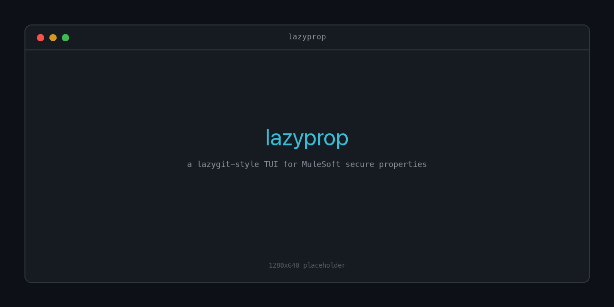
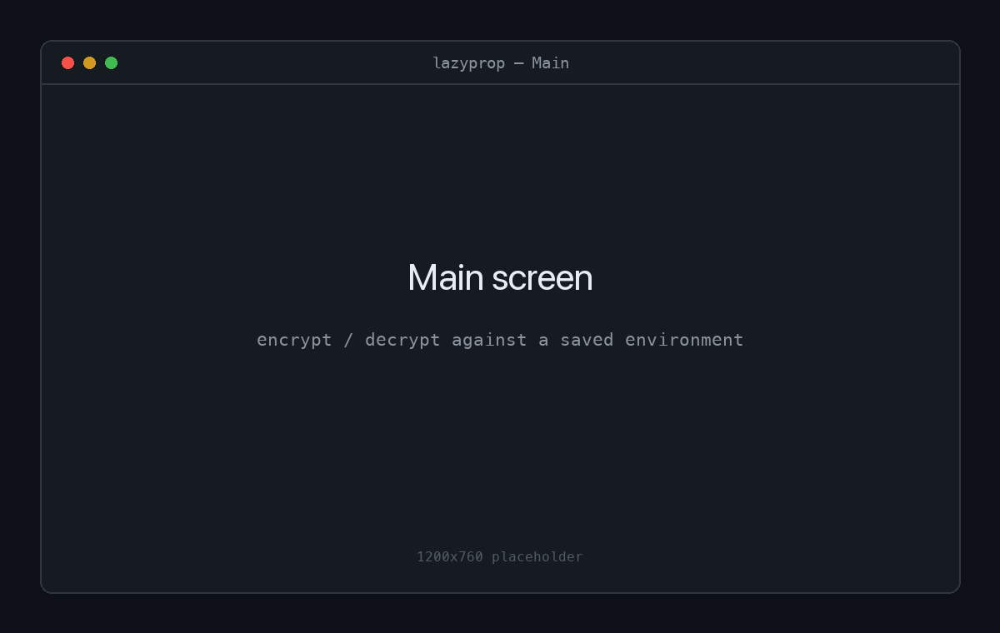
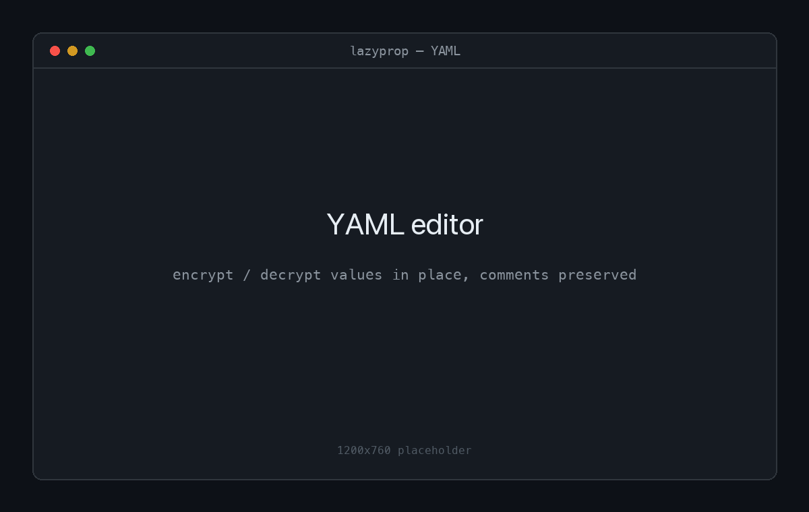
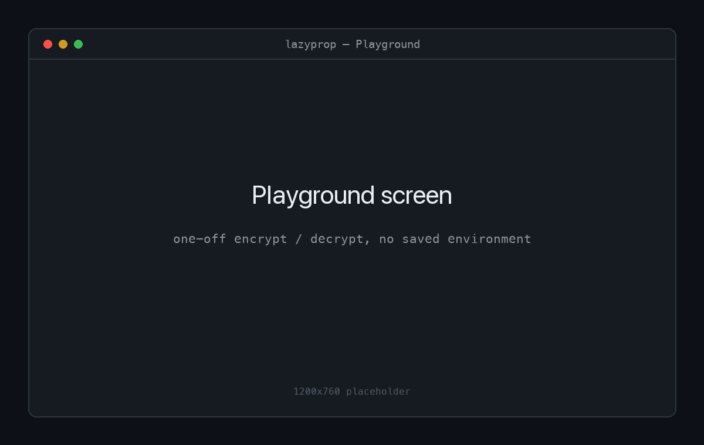
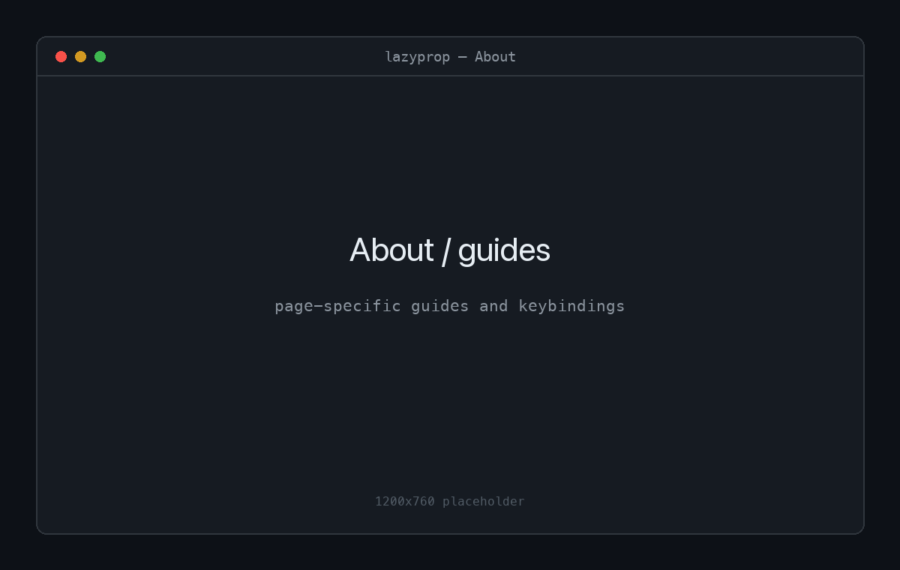

<div align="center">



# lazyprop

**A lazygit-style terminal UI for MuleSoft / Anypoint secure properties.**

Pick an environment, type a value, and encrypt or decrypt it on the spot — or
edit secure values straight inside a YAML file, in place. A friendly front end
over MuleSoft's `secure-properties-tool.jar`, so you never touch the Java
command line.

[](https://github.com/kchernokozinsky/lazyprop/actions)
[](https://github.com/kchernokozinsky/lazyprop/releases)
[](LICENSE)


</div>

---

## Why lazyprop

MuleSoft's Secure Properties Tool is powerful but awkward: a long Java
invocation for every value, with the algorithm, mode, key and flags all passed
by hand. `lazyprop` wraps it in a fast, keyboard-driven terminal UI:

- 🔐 **Environments** — save each algorithm / mode / key once, then encrypt and
  decrypt against it by name.
- 📄 **In-place YAML editing** — encrypt or decrypt individual values inside a
  `.yaml`/`.yml` file while comments, ordering and formatting stay byte-for-byte
  intact.
- 🧪 **Playground** — a scratch pad for one-off values with no saved
  environment.
- 🎯 **Contextual help** — the footer shows only the actions valid for the
  current screen, focus and mode; nothing to memorise.
- 🎨 **Themeable & legible** — ANSI-based colours that work on light and dark
  terminals, with a configurable accent.
- 📦 **Self-contained** — the Secure Properties Tool jar is embedded in the
  binary and extracted on first run. You only need a Java runtime.
- 🖥️ **Cross-platform** — macOS, Linux and Windows.

## Screenshots

> The images below are placeholders — replace the files in
> [`docs/images/`](docs/images) with real screenshots.

|  |  |
| --- | --- |
| **Main** — encrypt/decrypt against an environment | **YAML editor** — edit values in place |
|  |  |
| **Playground** — one-off values | **About** — page-specific guides |
|  |  |

## Requirements

A **Java runtime** (`java` on your `PATH`) — the encryption itself is done by
MuleSoft's Secure Properties Tool. The jar is **embedded in the binary** and
extracted to `~/.lazyprop` on first run, so you don't have to manage it.

## Installation

<details open>
<summary><strong>macOS / Linux — Homebrew</strong></summary>

```bash
brew install kchernokozinsky/tap/lazyprop
```

The formula pulls in a Java runtime automatically, so nothing else is needed.
</details>

<details>
<summary><strong>Windows — Scoop</strong></summary>

```powershell
scoop bucket add lazyprop https://github.com/kchernokozinsky/scoop-bucket
scoop install lazyprop
```

If you don't have Java yet:

```powershell
scoop bucket add java
scoop install temurin-jre
```
</details>

<details>
<summary><strong>Any platform — prebuilt binary</strong></summary>

Download the archive for your platform from the
[Releases](https://github.com/kchernokozinsky/lazyprop/releases) page, extract
the `lazyprop` binary, and put it on your `PATH`. You still need `java`
available (see [Requirements](#requirements)).

On Windows, download `lazyprop-x86_64-pc-windows-msvc.zip`, extract
`lazyprop.exe`, move it to a folder on your `PATH`, and install a Java runtime
such as [Adoptium Temurin](https://adoptium.net/temurin/releases/).
</details>

<details>
<summary><strong>From source</strong></summary>

```bash
cargo install --git https://github.com/kchernokozinsky/lazyprop
# or, from a checkout:
cargo build --release   # binary at ./target/release/lazyprop
```
</details>

## Quick start

Just run it — on first launch it creates `~/.lazyprop/` with a sample
environments file and the extracted jar:

```bash
lazyprop
```

Point it at a specific environments file, jar, or YAML file to open:

```bash
lazyprop --envs ./config/envs.yaml --jar /opt/secure-properties-tool.jar
lazyprop --file ./application.yaml
```

There are four screens, shown as tabs in the header: **Main**, **Playground**,
**YAML** and **About**. Switch with `1`–`4` (still supported) or `h` / `l`; `?`
jumps to About. The footer always shows the actions valid for the current
screen, focus and mode.

**Typical flow on the Main screen:**

1. Select an environment in the **Environments** list with `w` / `s` (or arrows).
2. Press `Tab` to focus the **Value** field and type/paste the text.
3. Press `Esc` (or `Enter`) to return to normal mode.
4. Press `e` to encrypt or `d` to decrypt — the result appears in the **Result**
   pane; `Ctrl-y` copies it.

The **Playground** screen is a one-off encrypt/decrypt form with no saved
environment — pick the Operation, Algorithm, State and Random-IV, type a Key and
Value, and press `Enter`. The **About** screen is a set of page-specific guides
(Main, Playground, YAML, General) switched with `←` / `→`.

## The YAML editor

Encrypt/decrypt individual values inside a `.yaml`/`.yml` file **in place**,
leaving comments, ordering and formatting untouched.

1. Press `3`, then `Ctrl-o` to open a file — **browse** the filesystem or `Tab`
   to **type a path** (`~` is expanded). Or start directly with
   `lazyprop --file ./config.yaml`.
2. The file is shown as a collapsible tree. Move with `w`/`s`, fold/unfold with
   `←`/`→`, and `Tab` toggles focus between the environments list and the tree.
3. Select an environment (the same ones as the Main screen).
4. On a scalar value, press `e` to encrypt or `d` to decrypt — only that value
   changes. Encrypted values are stored as `password: "![ciphertext]"` and are
   masked in the tree (`r` reveals them).
5. `Enter` edits a scalar manually; `Ctrl-s` saves atomically; `Ctrl-r` restores
   the document to exactly how it was opened. The header shows `Modified` when
   there are unsaved edits, and each changed property is marked with a subtle
   `●` until it is saved, restored, or edited back to its original value.
6. `E`/`D` bulk-encrypt/decrypt every scalar under the selected node; `/` filters
   the tree; `Ctrl-z`/`Ctrl-y` undo/redo; `a` adds an environment without leaving
   the screen. Leaving or replacing a file with unsaved changes prompts to
   **Save**, **Discard** or **Cancel**.

Encrypt/decrypt/edit results are written as quoted strings. Navigating to
`database.password` and pressing `e` turns:

```yaml
database:
  username: admin
  password: secret   # unchanged comment
```

into:

```yaml
database:
  username: admin
  password: "![encrypted…]"   # unchanged comment
```

> **Limitations.** Values written with flow style (`{}`/`[]`), block/multiline
> scalars (`|`/`>`), or anchors/aliases/tags are shown but not editable in
> place — lazyprop refuses to edit them rather than reformat the file.
> Encrypting a non-string scalar (e.g. a number) necessarily makes it a quoted
> string.

## The environments file

Environments are described in a YAML file (default `envs.yaml`):

```yaml
environments:
  - name: DefaultEnv
    algorithm: AES        # AES | Blowfish | DES | DESede | RC2 | RCA
    state: CBC            # CBC | CFB | ECB | OFB
    use_random_ivs: false
    key: secret1234567890
```

`key` must be a valid length for the chosen algorithm (e.g. 16 characters for
AES). When `use_random_ivs` is `true`, the `--use-random-iv` flag is passed to
the tool. Manage environments from the UI: `a` adds, `Enter` edits, `x` deletes
(with confirmation), and `/` filters the list — all changes are written back to
the file.

### Algorithm / mode compatibility

The **mode** (`state`) list is filtered by the selected **algorithm**, so you
can only pick combinations the tool accepts. Verified against the bundled jar:

| Algorithm | Modes |
| --- | --- |
| AES | CBC, CFB, ECB, OFB |
| Blowfish | CBC, CFB, ECB, OFB |
| DES | CBC, CFB, ECB, OFB |
| DESede | CBC, CFB, ECB, OFB |
| RC2 | CBC, CFB, ECB, OFB |
| RCA (RC4) | *(none — stream cipher, unsupported by the tool)* |

Changing the algorithm resets an incompatible mode to the default (CBC where
supported). **RCA** shows the mode as `n/a` and reports a clear "not supported"
error rather than failing deep inside the jar.

## Keybindings

| Key | Action |
| --- | --- |
| `w` / `s` (or `↑` / `↓`) | Previous / next environment · scroll |
| `1`–`4` | Jump to Main / Playground / YAML / About |
| `h` / `l` | Previous / next screen |
| `Tab` | Cycle focus |
| `/` | Filter / search |
| `e` / `d` | Encrypt / decrypt |
| `Ctrl-y` | Copy the result |
| `r` | Reveal / hide |
| `p` | Send environment → Playground |
| `a` · `Enter` · `x` | Add · edit · delete environment |
| `Esc` | Leave input · cancel · back |
| `?` | About / help |
| `q` · `Ctrl-c` | Quit |

**YAML screen:** `Ctrl-o` open · `w`/`s` navigate · `←`/`→` fold · `Enter` edit ·
`e`/`d` encrypt/decrypt · `E`/`D` bulk · `/` search · `Ctrl-z`/`Ctrl-y`
undo/redo · `Ctrl-s` save · `Ctrl-r` restore · `r` reveal · `a` add environment ·
`Tab` switch focus · `Esc` close.

Keybindings are configurable (see below). Encrypt/decrypt runs off the UI thread
(the pane shows `Working…`) so the interface never freezes during JVM start-up.

## Configuration

### The `~/.lazyprop` home

Like Maven's `~/.m2`, lazyprop keeps its files in a home directory. On first run
it creates **`~/.lazyprop/`** with a sample `envs.yaml` and the extracted
`secure-properties-tool.jar` (same location on every OS). Set `LAZYPROP_HOME` to
relocate it.

The **environments file** is resolved in this order (first match wins):

1. `--envs <path>`
2. `LAZYPROP_ENVS`
3. `./envs.yaml` in the current directory (project-local)
4. `~/.lazyprop/envs.yaml`

The **jar** resolves the same way (`--jar`, `LAZYPROP_JAR`,
`./secure-properties-tool.jar`, then `~/.lazyprop`).

### Keybindings, theme and logs

Keybindings and styles are read from a `config.{json5,json,yaml,toml,ini}` in
the config directory (`$LAZYPROP_CONFIG`, otherwise the platform config dir),
falling back to the bundled [`.config/config.json`](.config/config.json). A
`theme` section recolours the whole UI:

```json
{ "theme": { "accent": "magenta", "success": "green", "error": "red" } }
```

Recognised roles are `accent`, `success` and `error`; each value is a colour
name (`magenta`, `bright blue`, `color12`, …). Unset roles keep the ANSI
defaults. Logs go to `lazyprop.log` in the data dir (`$LAZYPROP_DATA`); set
`$LAZYPROP_LOG_LEVEL` (e.g. `debug`) to change verbosity.

## Development

```bash
cargo test                       # unit + render tests
cargo test -- --ignored          # also the Java round-trip test (needs a JRE)
cargo clippy --all-targets -- -D warnings
cargo fmt --check
cargo run                        # run the TUI
```

## License

[MIT](LICENSE) © [kchernokozinsky](https://github.com/kchernokozinsky)
